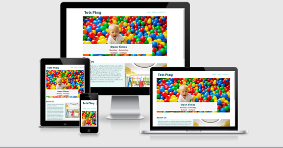

# Tots Play - A Milestone Project

<position: center;>

My first milestone project, undertaken as part of the Code Institutes Diploma in Software Development. 
Here is the link for Tots Play - insert link http//:totsplay 

# Who Is This Website For?

I have created this website for a small community stay and play centre based in High Wycombe, Buckinghamshire. 

The site is for parents who are looking to take their baby or toddler out for a couple of hours. 

Th aim of Tots Play is to introduce the potential customer to the facilities available on site and to make the venue appear a welcoming and fun place. 
A place to make connections with other parents and children, and a place to regularly meet.
They can watch their children interact with their environment and grow their skill sets through play and interactions. 

Parents of young children often are stretched for time or multi-tasking. With this is mind, I wanted the page to provide digestible information, at a glance. 
I did not want the site to appear cluttered or present over whelming content. I believe I have achieved this goal. 

# Local Testing
At first when I was adding the icons, they were not appearing on the site. I searched as to why this may have been and found that I had not embedded the file link into the index.html file. I placed this at the bottom of the file below the footer. Now that the directory was in the file, the icons appeared without further issue. 
When testing I found the link from contact us page does not lead directly the gallery page. I discovered that this is due to the link for the contact us and gallery page not being embedded in the others respective html file. I added this and it resolved the issue. 

Image in the about section was not loading, although it had initially worked. I changed the image and that led to the image being fixed. 

The images on the gallery page were not loading. I spoke to tutor support who made me aware that the file paths to the files were absolute and not relative as they should have been. I went in and amended this error and straight away the images appeared on the site. 

The contact us page's background was sitting to the top of the header, this has been amended by 

# UX - User Experience 

The project was planned in 5 stages; 

Strategy Plane 

Scope Plane 

Structure Plane

Skeleton Plane

Surface Plane 

# The Stratergy Plane 

## User Stories

## My Goal

From the information gathered from the 'user stories', and my own personal views, I wanted to create a site that was had the following. 

Easy to naviagate - This was to ensure first time learning, thus making the site intuitive.
I wanted a site that although designed to be viewed by adults, gave a clear impression of being a place that is suitable for children
I wanted the site to display all the key information that would be useful to help the visitier make a decision to physically come to Tots Play. 
I did this by ensuring opening times, services on offer and the address/contact details are all easy to locate on the home page. 
I included colourful and joyful images to convey a place that offers positive experiences to its visiters. 
I did not want the site to be overwhelming for those who view it, and I feel that I have achieved this

# The Scope Plane

The features of this project:

3 pages
A home page with live links
1 page to include pictures only 
1 page to have a form 

# The Structure Plane 

The website has an home page, gallery page and a contact us page. The design of each page has been kept simplistic. 
The goal of the site is to be very digestable and to only contain information which the viewer requires or that which makes a positive impression without overwhlming the overall design. 

## Home Page

## Navigation

## Footer

## Gallery Page

## Contact Us Page 

# The Skeleton Plane 

The design of this project was to make the contect simplistic to view on any screen size but being mobile friendly was also key. 

Below is a link to the wireframes I had completed 

Wireframe Tots Play 

# The Surface Plane 

The colours used:

I used the site coolers to bring togethera colour oalatte for the base f the website 

The Fonts used:

I used google fonts to discover and use fonts that I felt portrayed a playful yet well organised impression. 

