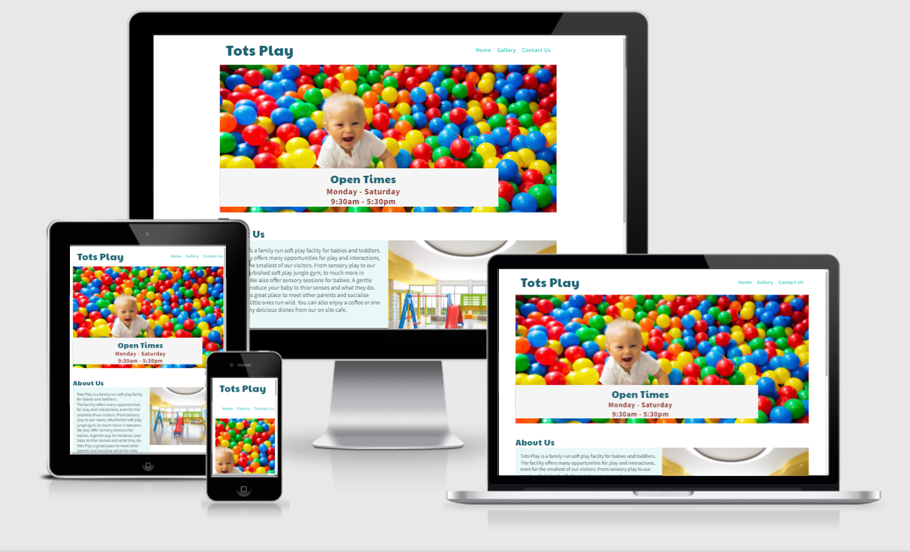
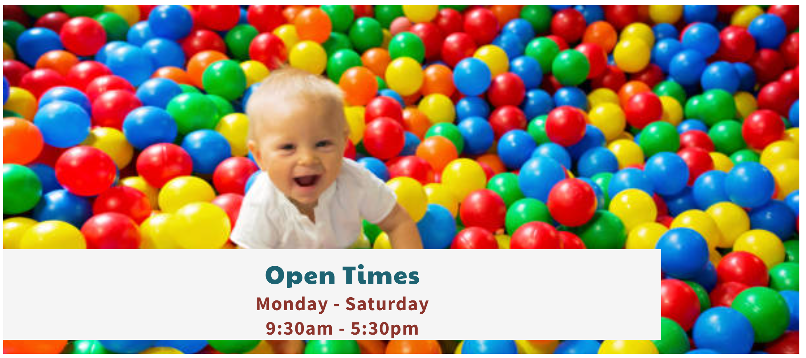
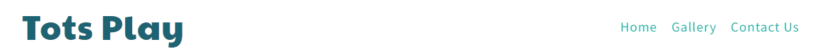
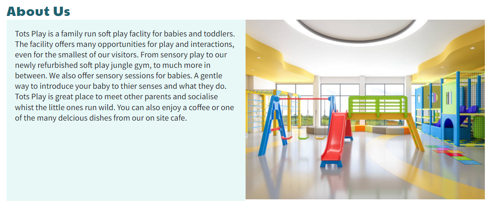
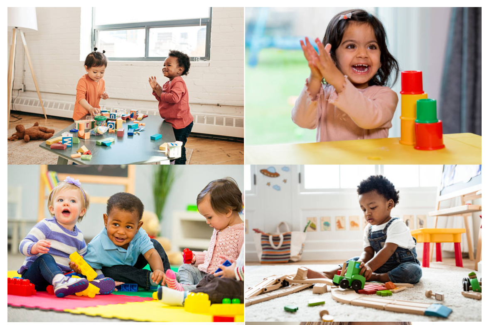
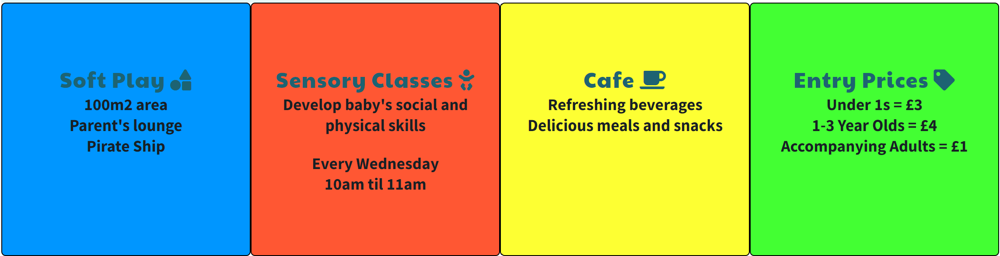
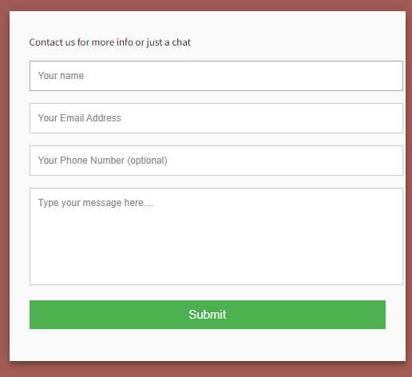
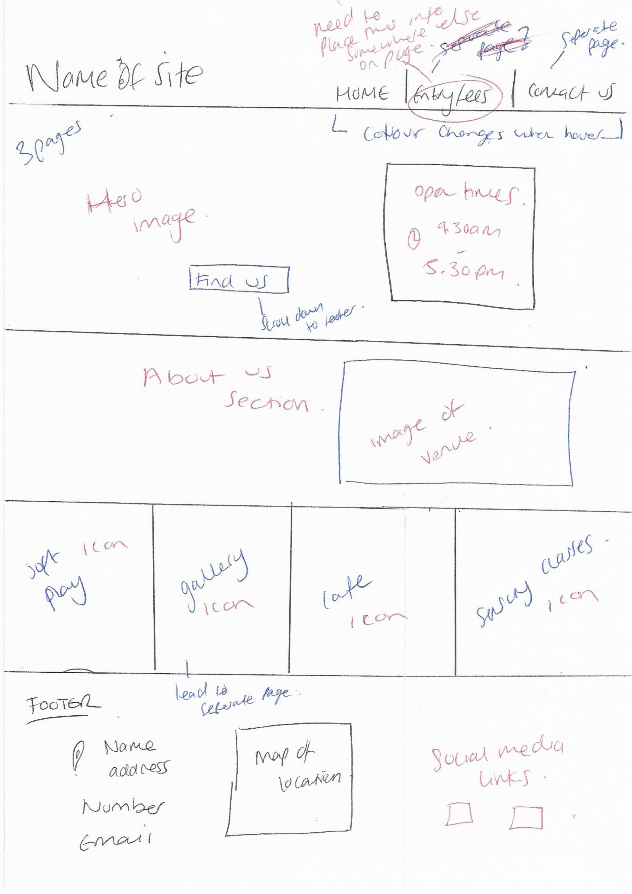
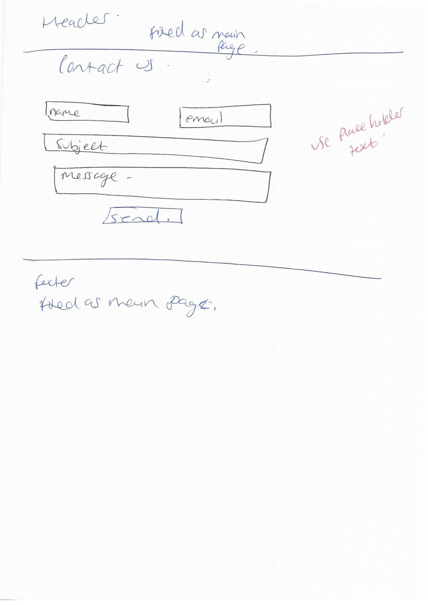
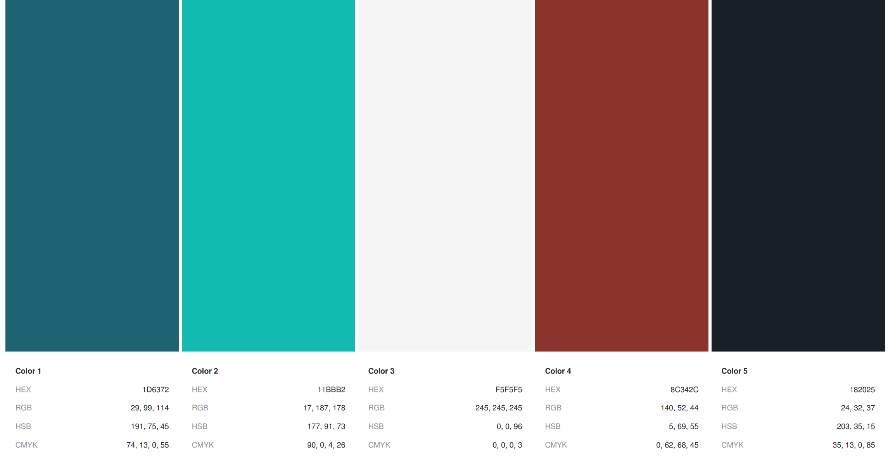

# Tots Play - A Milestone Project

My first milestone project, undertaken as part of the Code Institutes Diploma in Software Development. 
Here is the link for [Tots Play](https://jessmair.github.io/Tots-Play/index.html) 

# Who Is This Website For?

I have created this website for a small community stay and play centre based in High Wycombe, Buckinghamshire. 

The site is for parents who are looking to take their baby or toddler out for a couple of hours. 

Th aim of Tots Play is to introduce the potential customer to the facilities available on site and to make the venue appear a welcoming and fun place. 
A place to make connections with other parents and children, and a place to regularly meet.
They can watch their children interact with their environment and grow their skill sets through play and interactions. 

Parents of young children often are stretched for time or multi-tasking. With this is mind, I wanted the page to provide digestible information, immediately. 
I did not want the site to appear cluttered or present over whelming content. I believe I have achieved this goal. 

# UX - User Experience 

The project was planned in 5 stages. 

- Strategy Plane 

- Scope Plane 

- Structure Plane

- Skeleton Plane

- Surface Plane 

# The Strategy Plane 

## User Stories

-	As a user I want to be able to easily navigate through the site
-	As a user I want to be able to see clear information regarding the hours of operation
-	As a user I want to visualise what I can expect when I visit the stay and play
-	As a user I do not want the site to be overwhelming, but instead simplistic and concise
-	As a user I want to be able to call or email/send a message to the company through the site
-	As a user I want to be able to see the company address, and for it to be easily accessible no matter where I am on the site
-	As a user I want the site to be easy to learn so that when I return in the future, the sites layout is familiar as I have processed it the first time due to the site being logical in its presentation

## The Owner

- As the owner I want a site that is easy to navigate - This is to ensure first time learning, thus making the site intuitive.
- As the owner I want a site that although designed to be viewed by adults, gave a clear impression of being a place that is suitable for children
- As the owner I want the site to display all the key information that would be useful to help the visitor decide to physically come to Tots Play.  
- As the owner I want colourful and joyful images to convey a place that offers positive experiences to its visitors. 

# The Scope Plane

The features of this project:

3 pages
A home page with live links
1 page to include pictures only 
1 page to have a form 

# The Structure Plane 

The website has a home page, gallery page and a contact us page. The design of each page has been kept simplistic. 
The goal of the site is to be very digestible and to only contain information which the viewer requires or that which makes a positive impression without overwhelming the overall design. 

## Home Page

The hero image is colourful and shows a happy child playing in the ball pit. All to indicate a vibrant and joyful place to bring a child. 
The image also features a banner that has opening times detailed. This is to make this key information easy to find on the site.  

## Navigation

Available in the header of all three pages. The navigation bar is responsive and includes three-page links; 'Home', 'Gallery' and 'Contact Us'. The logo also leads back to the 'Home' page. 
These links will allow the user to navigate to the different pages of the site from any of the three pages. 

## About Us

A paragraph that builds an idea of what to expect from Tots Play. 
I have kept the language simple yet descriptive. I have mentioned what services are offered whilst making spending time at Tots Play enticing by using words that describe the place as fun, yet gentle. 
There is also an image that shows the apparatus on site. 

## Footer

The footer is fixed and therefore visible on all three pages. 
It contains address information which is vital. 
It also has a responsive link for Facebook, so when clicked on lead to Tots Play’s Facebook page. The Facebook icon was sourced from Font Awesome. 
The phone number, if clicked on from a mobile will allow a call to be placed directly which is very useful for a parent on the go. 
The email link opens up an outlook or whatever email server is set as the user's preference to make sending an email very easy and accessible.  

## Gallery Page

A selection of pictures showing toddlers having fun whilst playing and socialising at Tots Play 

## Services

This bar has a non-responsive design and is purely for information purposes only. 
A breakdown of what is on offer. The entry prices are also displayed, again key information that the parent would be keen to access. 
The colours used are inspired by the colours from the ball pit and give the site design a synergy. 
The headings are accompanied by logo fonts from google fonts. This is to add a decorative element and again at a quick glance assist the user in intuiting what the section contains.  

## Contact Us Page 

A simple form is included that asks for basic details and gives the option to free type a message to Tots Play

# The Skeleton Plane 

The design of this project was to make the content simplistic to view on any screen size but being mobile friendly was also key. 

Below is a link to the wireframes I had completed 

[]

[Wireframe page 1]("assets/images/wire1.jpg")

[Wireframe page 2](assets/images/wire2.jpg)

# The Surface Plane 

## Colour Palette

I used the site coolers to bring together a colour palette for the base of the website. The 2 dominant colours used were #1D6372 and #8C342C. These colours were chosen as they are eye catching, however not too bright and therefore portray a more positive image of Tots Play. 
After implementing the hero image, I did use the inspiration of the bright colours for the colouring of the "services" bar. However, the base colour of the site is based on the colour chart above. 

## Fonts

I used google fonts to discover and use fonts that I felt portrayed a playful yet well organised impression. 
I decided on Playtone One for the headings and Source Sans Pro as these two fonts complement one another. These fonts were found on Google fonts.   

## Features For the Future
Below are features that I would have liked to add but have been unable to do so yet due to time constraints and not having the knowledge to do so yet either. 
-	I will add a video of Tots play instead of the image of the apparatus to give the user a better scope of the size of Tots Play and all it has to offer. 
This is as some people prefer to see  things visually than read about it.
-	I would like to add a google map image of the location of Tots Play to the footer, so the user has a visual of where the address is on a map. 
-	A live link embedded in the address, when clicked on gives an option to open google maps to show location of address on their map. 

# Technologies used
- [HTML5](https://en.wikipedia.org/wiki/HTML) for markup 
- [CSS3](https://en.wikipedia.org/wiki/CSS) for style 
- [Google Fonts](https://fonts.google.com/) for fonts 
- [Github]( https://github.com/) to keep the file 
- [Gitpod]( https://www.gitpod.io/) for version control
- [Coolers.co]( https://coolors.co/) to build a colour palette for the site 
- [Font Awesome](https://fontawesome.com/v5.15/icons) for icons
- [Unsplash](https://unsplash.com/) for all the images on the site

# Resources
- [Code Institute](https://codeinstitute.net/) Course material
- [Code Institute](https://codeinstitute.net/) Slack community 
- [W3Schools]( https://www.w3schools.com/) 
- [Am I Responsive](http://ami.responsivedesign.is/) – Check the sites responsiveness
- [W3C](https://validator.w3.org/) Validate HTML code
- [W3C]( https://jigsaw.w3.org/css-validator/) CSS Validation 
- [W3Schools](https://www.w3schools.com/) - helped me in researching and fixing errors along the way

# Testing
I had a few issues with the site during the process of developing it. I tested the site after the implementation of each section. 
Along the way, I found the following errors:

- At first when I was adding the icons, they were not appearing on the site. I searched as to why this may have been and found that I had not embedded the file link into the index.html file. I placed this at the bottom of the file below the footer. Now that the directory was in the file, the icons appeared without further issue. 

- I found that the link from 'Contact Us' page does not lead directly the 'Gallery' page. I discovered that this is due to the link for the 'Contact Us' and 'Gallery' page not being embedded in the others respective html file. I rectified this and it resolved the issue. 

- The image in the 'About Us' section was not loading, although it had initially worked. I tried many times to resolve the issue on my own, however with no joy. In the end I changed the image and that led to the issue being fixed. 

- The images on the gallery page were not loading. I spoke to tutor support who made me aware that the file paths to the files were absolute, not relative as they should have been. I went in and amended this error and the images appeared on the site. 

- The contact us page's background was sitting to the top of the header. I couldn't understand why this had happened. I asked a slack member who was not able to help to locate the issue. 
I spoke to Spence Barriball, my mentor, and he was able to amend this issue for me. It had something to do with the syntax I had added for the form. I had unwittingly opened two form codes and not closed either. The issue was still more complex than this and therefore I have to credit Spence Barriball for resolving this issue for me. 

## Validators

I checked the HTML code with W3C Jigsaw and it returned 1 error;

- Warning: Consider using the h1 element as a top-level heading only (all h1 elements are treated as top-level headings by many screen readers and other tools).

There is no issue with the presentation if this heading on the site and therefore I do not intend on changing this code. 

I checked the CSS with W3C Jigsaw and no errors were found. 

# Responsiveness 

I checked the website's responsiveness using Google Chrome Dev Tools. Mobile, tablet and desktop sizes were tested, and all worked well. 
It also responded on each breakpoint that were set up on Media Query's and no visual or functional errors found

# Version Control 

- GitHub
- Gitpod

Gitpod served as the local repository and IDE. 
GitHUb served as the remote repository. 

The following steps were followed to maintain version control;

- I created a repository on GitHub and named it 'Tots Play' 
- I then signed in to Gitpod and opened a new workspace via the repository name 'Tots Play'
- I created the pages, folders and files on GitPod
- I saved my work on GitPod at regular intervals and pushed it to GitHub to keep it safe

This is the process I followed having completing each significant section of code, I typed the following into the terminal:
- git add . (This added the work to git)
- git commit -m "COMMIT MESSAGE" (This committed the work)
- git push (This pushed the work to GitHub)

# Deployment 

I followed the below steps on GitHub (insert link) to deploy the website. 

- Go to repository and select 'settings'. 
- Under the 'Github pages@ section, click on the live link. 
- On "Source", select "Branch: main' for Branch and click save.
- The website is now published on GitHub Pages and the link is provided on the same section